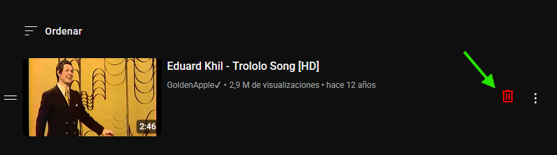

# Quick Remove from Watch Later

**Instantly remove videos from your YouTube “Watch Later” playlist with one click.**

---

## 📸 Screenshot



---

## 🔧 Installation

1. Install a userscript manager such as [Tampermonkey](https://www.tampermonkey.net/) or [Violentmonkey](https://violentmonkey.github.io/).
2. Click the **Install** badge below to add the script directly to your userscript manager:

   [](https://raw.githubusercontent.com/cansi22/watch-later-quick-remove/main/watch-later-quick-remove.user.js)


   *If the badge doesn’t work, manually copy the script by clicking [here](https://raw.githubusercontent.com/cansi22/watch-later-quick-remove/main/watch-later-quick-remove.user.js).*
3. In your userscript manager, click **“+ Add a new script”**.
4. Paste the script and save.
5. Navigate to your **Watch Later** playlist:

   ```
   https://www.youtube.com/playlist?list=WL
   ```
6. Look for the **red 🗑️ icon** next to each video—click to remove instantly.

---

## 🚀 Usage

* **Remove a video**: Click the 🗑️ button next to any entry in your “Watch Later” playlist.
* **No extra menus**: The script triggers YouTube’s internal delete action without opening context menus.
* **Instant feedback**: The video element is removed from the page immediately after deletion.

---

## 📦 Files

* **`watch-later-quick-remove.user.js`** – The main userscript.
* **`assets/capture.png`** – Animated GIF or screenshot showing the script in action.
* **`LICENSE`** – MIT License.
---
## Changelog
You can check all changes in [CHANGELOG.md](./CHANGELOG.md).

## 🤝 Contributing

Contributions welcome!

1. Fork the repository.
2. Create a feature branch:

   ```bash
   git checkout -b feature/awesome-feature
   ```
3. Commit your changes:

   ```bash
   git commit -am "Add new feature"
   ```
4. Push to the branch:

   ```bash
   git push origin feature/awesome-feature
   ```
5. Open a Pull Request on GitHub.

---

## 📄 License

This project is licensed under the [MIT License](LICENSE).
